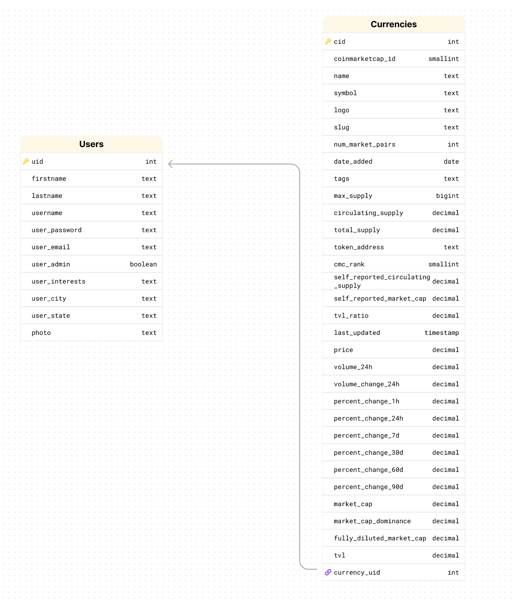
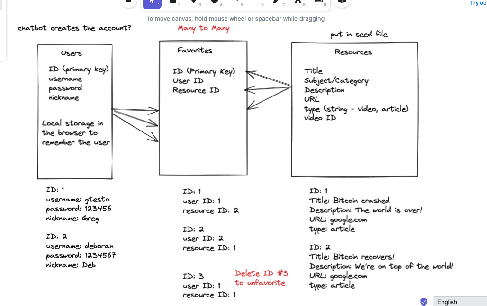

## Entity Relationship Diagram (ERD)



## september - TO DO
// Currencies.scss -> for User details page

// to do: get backend working for the 3rd table (and tested in backend, to be able to access the data in the 3rd table)

## (end of To Do section)

Adding to schema:

mine: logo (for the url images of coin logos)

----rest of API data----:

platform TEXT,

self_reported_circulating_supply TEXT,
self_reported_market_cap TEXT,
tvl_ratio TEXT,
last_updated TIMESTAMP,
price INTEGER,
volume_24h BIGINT,
volume_change_24h SMALLINT,
percent_change_1h SMALLINT,
percent_change_24h SMALLINT,
percent_change_7d SMALLINT,
percent_change_30d SMALLINT,
percent_change_60d SMALLINT,
percent_change_90d SMALLINT,
market_cap BIGINT,
market_cap_dominance SMALLINT,
fully_diluted_market_cap BIGINT,
tvl TEXT,


// platform can be 'null' or be an object
"platform": {
          "pid": 1027,
          "name": "Ethereum",
          "symbol": "ETH",
          "slug": "ethereum",
          "token_address": "0xdac17f958d2ee523a2206206994597c13d831ec7"
        },

<!-- home page - layout inspiration -->
<!-- https://sneakernews.com/ -->

<!-- Login Form in ReactJS with React Hooks (tutorial) -->
<!-- https://www.youtube.com/watch?v=91qEdc6dSUs -->

## dark mode using local storage
<!-- https://css-tricks.com/easy-dark-mode-and-multiple-color-themes-in-react/ -->

```
npm i use-local-storage
```
Local storage allows the theme to be stored, so a user can keep seeing the "light" or "dark" mode that was chosen, after page reload.


# One-to-many relationship (backend)

Models

Each model is represented by a table in the database.
- Users
- Currencies

Relationships

The tables have a one-to-many relationship

- A user has many currencies
- Each currency has a user

# CoinMarketCap API (where I got my data from)

I'm not using the API directly for this project, but instead using it as a starting point, so I can have some actual real-world data to work with.

[CoinMarketCap API Documentation](https://coinmarketcap.com/api/documentation/v1/#section/Quick-Start-Guide)

## (Sandbox)

testing with sandbox environment (has mock data only):
```
sandbox-api.coinmarketcap.com
```
To get real data, replace sandbox with:
```
https://pro-api.coinmarketcap.com
```

1. Preferred method: Via a custom header named `X-CMC_PRO_API_KEY`
2. Convenience method: Via a query string parameter named:
```
CMC_PRO_API_KEY
```

test API Key:
```
b54bcf4d-1bca-4e8e-9a24-22ff2c3d462c
```

Example link to fetch the data:
```
https://sandbox-api.coinmarketcap.com/v1/cryptocurrency/listings/latest?CMC_PRO_API_KEY=b54bcf4d-1bca-4e8e-9a24-22ff2c3d462c
```

# Data used in this app

// 20220713205413 - July 13, 2022 8:54pm
Stored in backend file: `cryptoListingsLatest.json` for now
`https://pro-api.coinmarketcap.com/v1/cryptocurrency/listings/latest?CMC_PRO_API_KEY=` (add API Key to the ending of this URL in browser)


# Capstone Team

* [Christina Loiacono](https://www.linkedin.com/in/christina-loiacono/)
* [Deborah Campos](https://www.linkedin.com/in/debdev3/)
* [Milton Clark](https://www.linkedin.com/in/milton-clark-93674b114/)
* [Oliver Chuzan](https://www.linkedin.com/in/oliverchuzan/)

# Deployed Links
Backend: [https://cryptotalk-cl.herokuapp.com/](https://cryptotalk-cl.herokuapp.com/)

Frontend: [https://cryptotalk-cl.netlify.app/](https://cryptotalk-cl.netlify.app/)

# Overview

## Entity Relationship Diagram (ERD)


# Getting Started

After forking and cloning this project, run these commands on the backend:
```
npm i
```
You will need a `.env` file for the backend (with these fields completed)
```
PORT=
PG_HOST=
PG_PORT=
PG_DATABASE=
PG_USER=
PG_PASSWORD=
```

## Basic commands to run the backend

First, `cd` into the backend directory using the terminal.

To run the backend, you'll find these scripts in the `package.json` file.
Run them **in this order** to initialize the database, seed the database, and then start the backend.

```
npm run db:init
npm run db:seed
npm start
```

Go to your browser, and go to 
`http://localhost:[name of backend port]`

example: `http://localhost:3333/`

# Frontend

After forking and cloning this project, run these commands on the frontend:
```
npm i
```

In a previous version of this app, Material UI was used. It has been removed.

In case there are issues with [Material UI](https://mui.com/), run this command: 
```
npm install @mui/material @emotion/react @emotion/styled

```

This app will now be using CSS and SASS.
[Node-Sass]():
```
npm install node-sass
```

## react-icons
[react-icons](https://react-icons.github.io/react-icons)

```
npm install react-icons --save
```
Example: Mobile layout - collapsible menu icon


## Chart.js
https://www.chartjs.org/docs/latest/charts/line.html
https://www.npmjs.com/package/react-chartjs-2
https://upmostly.com/tutorials/how-to-use-chart-js-with-react
```
npm install chart.js
npm i react-chartjs-2
```

## axios
```
npm install axios
```

## Basic command to run the frontend

First, `cd` into the frontend directory using the terminal.

To run the frontend, you'll find this script in the `package.json` file.

```
npm start
```

This should open up automatically in the browser, but if it doesn't, go to 
`http://localhost:[name of frontend port]`

example: `http://localhost:3000/`

# Backend Routes

Our backend database using [Postgres](https://www.postgresql.org/) has three tables: `users`, `resources`, and `favorites`.  These are the routes for each table:

## Users Table

| Resource | Method | Route        | Description                              |
|----------|--------|--------------|------------------------------------------|
| users    | GET    | /users       | Get all `users`.                         |
| users    | POST   | /users       | Create a `users`.                        |
| users    | GET    | /users/{uid} | Return one `users` by their id of {uid}. |
| users    | PUT    | /users/{uid} | Update one `users` by their id of {uid}. |
| users    | DELETE | /users/{uid} | Delete one `users` by their id of {uid}. |

<!-- ## Platforms Table
| Resource      | Method | Route        | Description                              |
|---------------|--------|--------------|------------------------------------------|
| platforms    | GET    | /platforms  | Get all `platforms` by id of {currId} that belong to a currency.    
| platforms    | GET    | /platforms/{token_address}  | Get one `platforms` by id of {token_address} of a specific currency. 
| platforms    | POST   | /platforms  | Create a `platforms`
| platforms    | PUT    | /platforms/{token_address}  | Update one `platforms` by id of {token_address}
| platforms    | DELETE | /platforms/{token_address}  | Delete one `platforms` by id of {token_address} -->

## Currencies Table
### All Coins Controller (currencies table)

| Resource      | Method | Route        | Description                              |
|---------------|--------|--------------|------------------------------------------|
| currencies    | GET    | /coins  | Get all `currencies` that exist in the database.                 |
| currencies    | GET    | /coins/{cid}  | Get one `currencies` by id of {cid} for every coin that exists in the database. 

### Currencies Controller (currencies table)

| Resource      | Method | Route        | Description                              |
|---------------|--------|--------------|------------------------------------------|
| currencies    | GET    | /currencies  | Get all `currencies` by id of {userId} that belong to a user.    
| currencies    | GET    | /currencies/{cid}  | Get one `currencies` by id of {cid} of a specific user. 
| currencies    | POST   | /currencies  | Create a `currencies`
| currencies    | PUT    | /currencies/{cid}  | Update one `currencies` by id of {cid}
| currencies    | DELETE | /currencies/{cid}  | Delete one `currencies` by id of {cid}

<!-- ## Resources Table

| Resource  | Method | Route                      | Description                                                                  |
|-----------|--------|----------------------------|------------------------------------------------------------------------------|
| resources | GET    | /users/{id}/resources      | Return all `resources` associated with the `users` with and id of {id}.          |
| resources | GET    | /users/{id}/resources/{id} | Return details of one `resource` associated with the `users` with an id of {id}. | -->

<!-- ## Favorites Table

| Resource  | Method | Route                      | Description                                                                      |
|-----------|--------|----------------------------|----------------------------------------------------------------------------------|
| favorites | GET    | /users/{id}/favorites      | Return all `favorites` associated with the `users` with and id of {id}.          |
| favorites | GET    | /users/{id}/favorites/{id} | Return details of one `favorite` associated with the `users` with an id of {id}. |
| favorites | POST   | /users/{id}/favorites      | Creates a new `favorite` associated with the `user` with an id of {id}.          |
| favorites | DELETE | /users/{id}/favorites/{id} | Deletes one `favorite` associated with the `users` with an id of {id}.           | -->

<!-- ## Not Currently in Use / Potential Stretch for Admin 
| Resource | Method | Route        | Description                            |
|----------|--------|--------------|----------------------------------------|
| resources | POST   | /users/{id}/resources      | Creates a new `resource` associated with the `user` with an id of {id}. |
| resources | PUT    | /users/{id}/resources/{id} | Updates one `resource` associated with the `users` with an id of {id}. |
| resources | DELETE | /users/{id}/resources/{id} | Deletes one `resource` associated with the `users` with an id of {id}. | -->


## Miscellaneous

[Random password generator](https://passwordsgenerator.net/)

[Random username generator](https://jimpix.co.uk/words/random-username-generator.asp#results)

[Random email generator](https://generator.email/)

[Random US Cities](https://www.randomlists.com/random-us-cities)

<!-- svg image used for DesktopColoring (svg with background) -->
<!-- https://www.iconpacks.net/free-icon/laptop-coin-2469.html -->
<!-- https://www.iconpacks.net/free-icon/mobile-phone-coin-2470.html -->


<!-- Layout Inspiration & Coin Logos -->
<!-- https://www.fxempire.com/crypto -->
<!-- Example: https://responsive.fxempire.com/v7/_fxcrypto_/crypto/crypto-logos/ada.png -->


<!-- color palette inspiration: -->
<!-- https://colorswall.com/palette/83601 -->

<!-- image editor (used for About Me page backgrounds) -->
<!-- https://studio.pixelixe.com/#add-image-to-photo -->